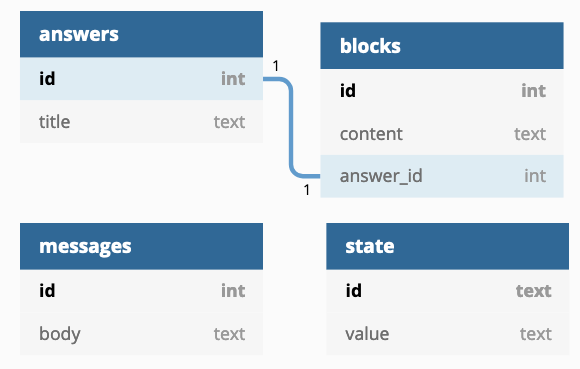

# Solution

Python is chosen as the implementing language to the solution.


## Run Instructions
To run the program first create a virtual environment:
```
python3 -m venv env
source env/bin/activate
pip install -r requirements.txt
```
Then to run the web server:
```
python3 python/app.py
```

Test the messages endpoint by running the following:
```
curl 'http://localhost:5000/messages'
```

And the search endpoint with the query "Star Trek":
```
curl -d '{"query":"Star Trek"}' -H "Content-Type: application/json" -X POST http://localhost:5000/search
```

## Solution Overview
Code organization is top of mind here.  The program is broken down into appropriate modules, classes and methods.  `app.py` is kept light, containing logic related to the web server.  It translates input/output and calls backend services.  The `/messages` and `/search` methods are implemented in respective modules.  Common `util` and `config` modules are also there.

Attention was paid to the coding style of the original program.  The style has been preserved throughout the rest of the code for consistency.  One example is the generous use of list comprehensions.

### Making it Work
A full working solution has been provided.  The messages feature is extended to fill in template messages.  Each message is parsed out and for each variable the state table is queried, with the result (or default value if none) filled in.

The one exception is the failing unit test `TestSearch.test_expect_the_unexpected`.  This is explained further in the next section.

### Making it Right
The search feature required the following feature enhancements:

- Respond with 400 on bad input
- Include answer blocks in response
- Search within the content block fields in addition to the title
- Search behaviour matches ALL terms ANYWHERE in the text
- Omit matches to content JSON keys and `type` field in search results

Satisfying the final requirement means going beyond SQL queries.  In following the spirit of the question the solution works with the JSON data directly.  It deserializes content JSON (with a preliminary match - more on that [below](#Making-it-Fast)) and searches the dictionary.  A [recursive dictionary search algorithm](util.py#32) implements the unique search behaviour by only looking for substring matches in dictionary values.  This is to satisfy the test cases `test_type_should_be_excluded` and `test_field_names_should_be_excluded`.

### Making it Fast
An approach to speed which focused on the application code was taken.  Care was taken to pass appropriate data structures between functions, not repeat parsing of data, and so forth.

DB information retieval relied on the existing DB schema rather than utilizing caching.  This is because of an assumption real-world data would consist of many more records than can be stored in memory (as is typically the case with databases).

The `messages` endpoint requires one query to fetch the messages but an additional query for every variable filled in.  This falls back on the large dataset assumption, but a caching solution would simply load all variables into a dictionary in advance.  At query time variables would be accessible with negligible overhead.

The `search` endpoint provides plenty of opportunity for optimizations.

The solution deserializes JSON from `blocks.content` then serializes when returning to the client.  This is extremely costly in CPU terms and can cause scaling issues, especially in an interpreted language such as Python.  Because of the assumptions made under _Make it Right_ these operations were necessary.  A pursuit of speed would visit this and investigate ways to treat as raw string data, eliminating the CPU overhead.

Significant effort went into reducing the total number of nested JSON/dictionary searches.  First, searches matched entirely in the answer are omitted from further searches.  Second, only records with matching search terms are returned in the SQL query.  In effect, the dictionary search is only performed to ensure the matches occur in JSON values and not keys or the `"type"` meta-field.

Optimization is a tricky process that requires planning and care.  What's faster in one scenario may be slower in another.  Something as simple as changing match rates in data can drastically alter algorithm performance.  Considerations into prioritizing average case versus worse case must also be weighed.  Another consideration is the speed of processing a single request versus total throughput.  It has been said that _Premature optimization is the root of all evil_.

# Hello World

Welcome to the Ada Tech Hiring test! This test is designed to let you **prove** that you can program, whether you have relevant credentials or not.

This test is inspired by problems we have run into in our work and we expect you to tackle it like any other work problem. You may use any of the offered programming languages as well as your favourite editor. Feel free to google-and-stackoverflow your way to success.

As for the programming challenges, we suggest you stick to the old programming mantra:

- Make it work
- Make it right
- Make it fast

The most important thing is to make your solution work somehow. If you then can clean it up and make it _right_, all the better. As for the code, don't feel bound by what is already there. Add functions and datastructures as you see fit, and delete old code with abandon if you don't find it helpful (as long as the unit tests pass). If you are unsure on whether to develop [_enterprise-edition software_](https://github.com/EnterpriseQualityCoding/FizzBuzzEnterpriseEdition) to show us that you know how to build _serious projects_ please keep in mind that we at Ada strongly value readability and simplicity.

Additionally, as we all know, working code is only half the battle in our industry, therefore we would like you to give some thought on how you would have to change your code under production load. For instance, does your current approach expect a dataset to fit into memory? Why? Do you expect this to work with real-world data or would you have to change something, and if so, what? Would you change your solution if you had 100 instances running at the same time, as opposed to on one beefy server? Do you optimize for latency or simplicity in your solution? Please consider your assumptions and their trade-offs and write them out explicitly; either directly as code comments or in a separate document.


# The Setup

You are working on a database-backed web-app in which you have to fix bugs and add new functionality (sounds familiar?).

The application is written in one of Python3, Node.js/Javascript, or Clojure. The choice is yours! You can find the aforementioned application in its respective folder and you can run it by executing the supplied `run.sh` script. Make sure to install the relevant libraries; we trust you know how.

The database of the application can be queried through SQL and has the following schema:



This is a simplified version of our bot schema, in which an `answer` (something that a bot says) consists of several, potentially deeply nested "blocks" (that are all stored as one big JSON blob per answer in the `blocks` table). These blocks represent functionality, such as showing text, showing images, performing HTTP requests, etc. The lower row of the diagram shows the `messages` table which show the messages that the bot has sent. Finally, `state` includes some conversation state that will be relevant in the first challenge.

Unlike in real-life there is also a test-suite that will give you instant feedback on whether your solution works or not. You can run the tests through `python3 tests/testname.py` (there is also a script that uses docker if your Python installation isn't up to date!).

# Challenge 1: Messages

The `/messages` endpoint returns all the messages in the database. Try running the application and hitting the endpoint [in your browser](http://localhost:5000/messages) or through `curl http://localhost:5000/messages` (do it now!).

Unfortunately, as you can see, the messages only show the message *template* instead of the actual message because the variable values have not been filled in! In our message template, variables are identified by `{|}`. Everything after the initial `{` and before the `|` is the variable id, and everything after the `|` but before the closing `}` is a _fallback_ value, in case there is no value for this variable.

In this application, variable values are stored in the `state` table. For example, consider the template string `Hello {asdf|planet}`. If the `state` table has a row with the id `asdf`, and value of `Earth`, then the processed message should read `Hello Earth`. If no such row exists, then the string should read `Hello planet`.

Your mission, should you choose to accept it, is to modify the `/messages` route to fill in the correct variable values into the messages so that we may all profit from the wisdom within!

You can test your result by running `python3 tests/test_messages.py`


# Challenge 2: Search
The `/search` endpoint performs a search for answers based on their titles, for example:

```sh
curl -d '{"query":"Star Trek"}' -H "Content-Type: application/json" -X POST http://localhost:5000/search
```

will result in
```js
[{
    "id": 3,
    "title": "Star Trek API"
 }]
```

Due to changing business requirements and demanding clients, you will now have to modify the endpoint to not only return the _full_ answer (including its blocks), but also allow search within the content block fields! Don't forget to _also_ search the title, and while you're at it, please make sure that the endpoint `400`s on invalid input, as is best practice. Lastly, we now also want to support searching for multiple terms that **all** have to show up **somewhere** in the answer.

You can test your solution through `tests/test_search.py`. Have a look at it too, as it will probably answer a lot of the questions you may be having.

It's possible to cheat your way into something that passes the specific test cases provided but goes against the spirit of the question. We'd rather you solve what we _mean_ and not *just* colour inside the lines that the tests provide :)

Good luck and ... _live long and prosper_ 🖖
